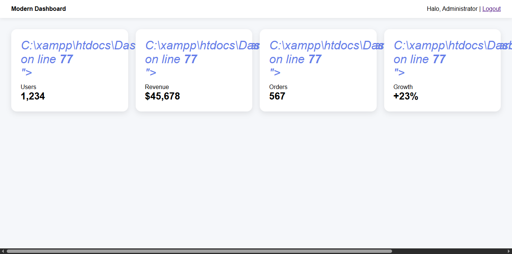
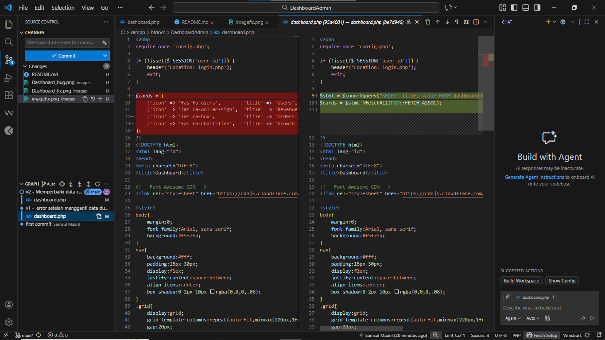
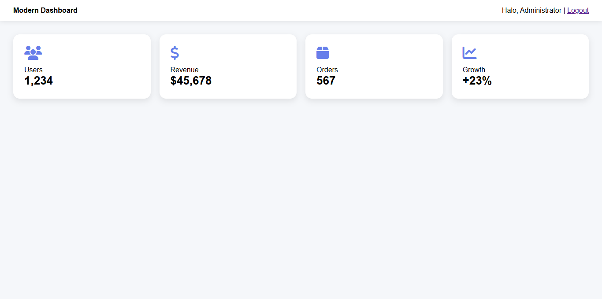

# Studi Kasus QA - Dashboard

## Bug v1
Terjadi error saat mengganti data dummy menjadi data dari database. Pada versi awal, icon card tidak muncul.

## Penyebab
Perbedaan struktur data antara array dummy (`$cards` awal) dan hasil query database.  
Pada kode lama, iterasi menggunakan `$c` tapi icon dipanggil dengan `$card['title']`.

## Perbaikan v2
Menyesuaikan struktur tampilan agar sesuai dengan data database.  
Variabel icon diganti menjadi `$iconMap[$c['title']]` sesuai iterasi, dan ditambahkan `htmlspecialchars()` untuk keamanan.

