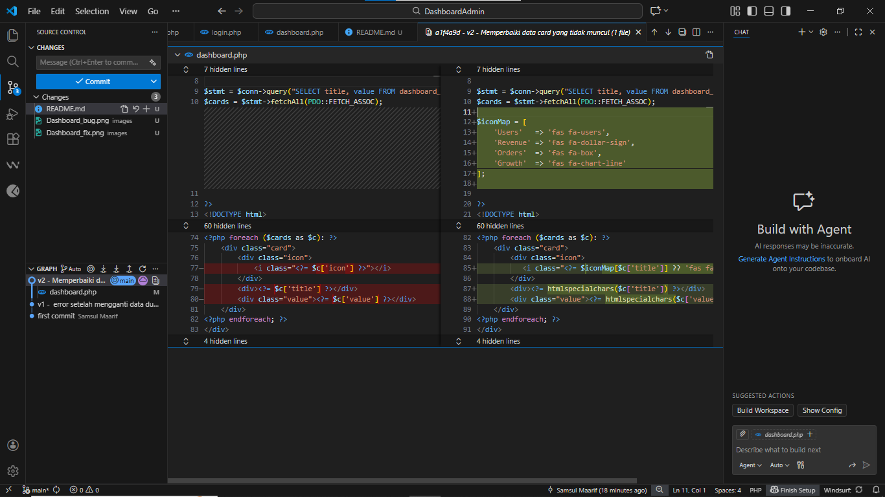

# Studi Kasus QA - Dashboard

## Deskripsi Proyek
Dashboard Admin Modern ini dirancang sebagai pusat kendali utama untuk memantau dan mengelola sistem secara efisien. Dengan tampilan yang bersih, minimalis, dan responsif, dashboard ini memberikan pengalaman pengguna yang nyaman sekaligus informatif bagi administrator.

Proses penggunaan diawali dari halaman login yang aman dan modern dengan antarmuka yang sederhana, sehingga memudahkan admin dalam mengakses sistem. Setelah berhasil login, admin diarahkan ke halaman dashboard utama yang menampilkan ringkasan data penting secara real-time dalam bentuk kartu informasi (cards).

Dashboard menyajikan metrik utama seperti jumlah pengguna, total pendapatan, jumlah pesanan, serta tingkat pertumbuhan yang ditampilkan secara visual dan mudah dipahami. Setiap kartu dirancang untuk memberikan gambaran cepat mengenai kondisi sistem tanpa perlu membuka detail data secara mendalam.

Selain itu, dashboard menampilkan identitas admin serta menyediakan fitur logout untuk menjaga keamanan dan kontrol akses. Secara keseluruhan, dashboard admin ini berfungsi tidak hanya sebagai alat monitoring, tetapi juga sebagai pendukung pengambilan keputusan yang cepat, akurat, dan berbasis data.

---

## Bug v1
Terjadi error saat mengganti data dummy menjadi data dari database. Pada versi awal, icon card tidak muncul.

## Penyebab
Perbedaan struktur data antara array dummy (`$cards` awal) dan hasil query database.  
Pada kode lama, iterasi menggunakan `$c` tapi icon dipanggil dengan `$card['title']`.

## Perbaikan v2
Menyesuaikan struktur tampilan agar sesuai dengan data database.  
Variabel icon diganti menjadi `$iconMap[$c['title']]` sesuai iterasi, dan ditambahkan `htmlspecialchars()` untuk keamanan.

